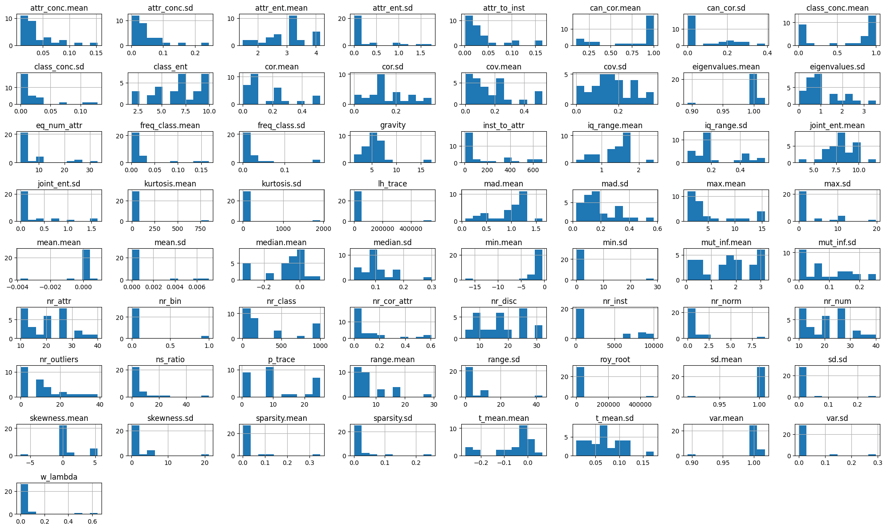
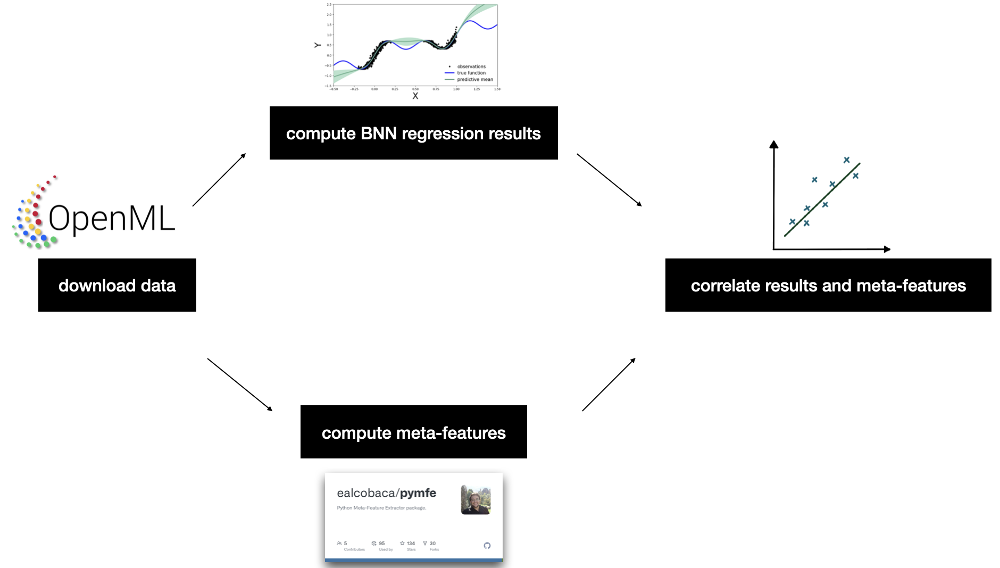
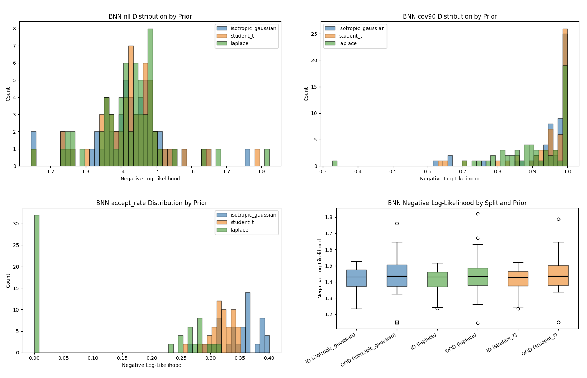
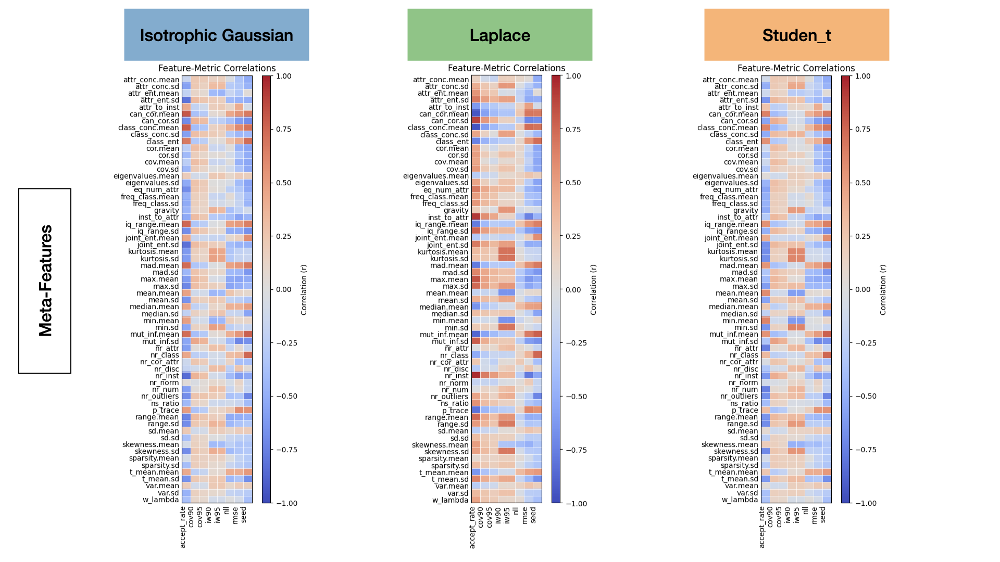
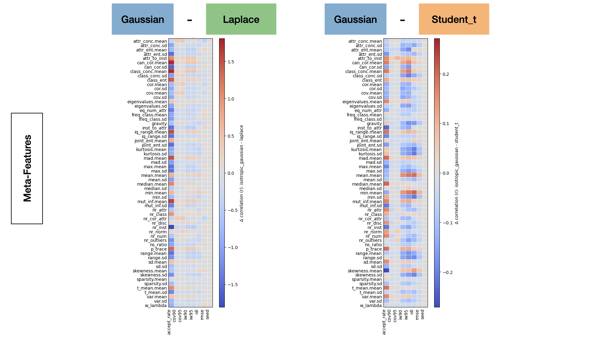

# Priors in Weight Space for Bayesian Neural Networks
_Final Project Report (Bayesian Machine Learning)_

**Author:** Fynn Gerding

---

## TL;DR

In this repository, I compare three common weight-space priors for Bayesian Neural Networks (BNNs), **isotropic Gaussian**, **Laplace**, and **Student–t**, on a set of small/medium tabular regression tasks from [OpenML](https://www.openml.org). Using a simple MLP BNN architecture across priors, I evaluate **negative log-likelihood (NLL)**, **predictive interval coverage** (90% nominal), and **ID vs OOD** robustness. Finally, I relate performance to **dataset meta-features** extracted with [`pymfe`](https://pymfe.readthedocs.io).

**Takeaways.** No single prior dominates across tasks, but for the currated datasets that I use performance is quite equal. This suggests that priors may better be chosen for individual problems than infered from meta-features.

---

## 1. Motivation & Research Question

The default in BNNs is an **isotropic Gaussian** prior on weights. Recent work argues that prior choice strongly shapes the **functional prior** and calibration, and the community has started to question whether Gaussian priors are always sufficient. I therefore ask:

> **How do Gaussian, Laplace, and Student–t weight priors affect predictive performance, uncertainty, and robustness across diverse tabular regression datasets?**

Gaussian priors are a popular baseline, but can alternative priors (e.g., Laplace, Student–t, horseshoe) be used to address e.g. sparsity or heavy tails? What meta-features should impact the choice of prior for a given task?

---

## 2. Data & Meta-Features

- **Datasets.** Several small-to-medium **tabular regression** datasets were sourced from **OpenML** (via the API). The data is cleaned and normalized before training.
- **Meta-features.** We characterize each dataset with **pymfe** meta-features (e.g., attribute concentration, entropy, kurtosis/skewness, sparsity, eigenvalue summaries,...).

**Reproducibility.** The `notebooks/` include visualizations; preprocessing and meta-feature extraction with `pymfe` are done in `dataio/`, `pipelines/discover_datasets.py` and `cli/discover.py`.

---

## 3. Models & Inference

- **Architecture.** A simple fully-connected **MLP regression BNN** is used for all priors (same architecture/hyperparameters).
- **Priors.**
  - **Gaussian:** $w \sim \mathcal{N}(0, \sigma^2 I)$
  - **Laplace:** $w \sim \mathrm{Laplace}(0, b)$
  - **Student–t:** $w \sim t_{\nu}(0, s^2)$

- **Scale selection.** Prior scales are chosen to yield comparable prior predictive variance on standardized inputs.

- **Initialization.** network weights using Xavier (Glorot) initialization to ensure stable variance propagation across layers.
- **Inference.** I use the Metropolis–Hastings algorithm to sample from the posterior distribution over network weights.
- **Metrics.**
  1. **Test NLL** (lower is better),
  2. **90% predictive interval coverage** (cov90; closer to 0.9 is better),
  3. **MH accept rate** (as a proxy for geometry/sampler fit),
  4. **ID vs OOD NLL** via geographic/feature-range splits.
  5. ...

**Pipeline overview**

---

## 4. Results

### 4.1 Predictive fit, coverage, and sampler diagnostics

Below: test NLL distributions, 90% coverage (cov90), MH accept-rate histograms, and ID/OOD NLL boxplots for all three priors.

**Observations.**
- **Predictive fit (NLL).** Distributions largely overlap; dataset-to-dataset variability is equal across all priors.  
- **Coverage.** Again, a very even, left-taled distribution across priors.
- **Accept rate.** Laplace/Student–t priors can reduce accept rates under identical mass/step-size settings, indicating a need for **tuning/adaptation** specific for each prior.  
- **ID vs OOD.** On some datasets, heavy-tailed priors yield *slightly* better OOD NLL (less overconfidence), while performance in-distribution remains comparable.

### 4.2 What kind of datasets benefit from which prior?

The heatmap visualizes the correlations between dataset meta-features (rows) and BNN performance metrics (columns) for the three weight-space priors: Isotropic Gaussian, Laplace, and Student–t.
Each color cell represents the Pearson correlation coefficient between a meta-feature (e.g., skewness, kurtosis, sparsity) and a metric such as test NLL, coverage, or acceptance rate.

Patterns indicate how dataset characteristics relate to model behavior under different priors. While there is a pattern, it is hard to infer what makes a prior suitable for a specific dataset. This visualization may therefore serve more as a starting point to future research than as a final conclusion.

We correlate each metric with dataset meta-features per prior and visualize **$\Delta$-correlation** relative to the isotrophic Gaussian. Most heavily impacte by the meta-features of the data seems the acceptance rate of the MH sampler.

Signals are modest but suggest that **skewness/kurtosis**, **attribute concentration/entropy**, and **sparsity** can tilt the balance toward **heavy-tailed** priors. This supports a **meta-learning** view of prior selection: choose heavier tails when inputs are skewed/sparse or when OOD risk is high.

---

## 5. Limitations and Extensions

Future work can extend this study by incorporating **more datasets** and **richer meta-features**, allowing for broader generalization and more robust statistical conclusions. Beyond simply quantifying **correlations** between dataset meta-features and BNN performance, a deeper, causal analysis should explore **why** specific data characteristics (e.g., skewness, sparsity, entropy) influence prior effectiveness.

**Assumptions:** The current implementation makes seeral assumptions, e.g. that the **average of datasets is representative**, a **fixed architecture** suffices for fair comparison, **mean imputation** is adequate for missing values, and datasets without any prior achieving reasonable performance can be **excluded**. These assumptions ensure consistent evaluation across priors while keeping results interpretable and reproducible, but should be revisited in future work.

---

## 6. Conclusions

- There is **no universally best prior** across tabular regression tasks.
- **Data characteristics matter.** Meta-features offer a practical way to **guide prior choice**; future work could focus more on the architecture and try to learn a *mapping from meta-features to prior hyperparameters*.
